# 🏗️ System Architecture

## Overview

This document provides a detailed explanation of the log aggregation system's architecture, design decisions, and data flow.

---

## System Components

### 1. **Ingestion Layer** (FastAPI)

**Purpose:** High-performance log ingestion with multiple endpoints

**Key Features:**
- **Async/await** - Non-blocking I/O for concurrent request handling
- **Multiple endpoints** - Direct DB writes vs. Redis queue
- **Auto-parsing** - Intelligent format detection
- **WebSocket support** - Real-time log streaming

**Endpoints:**
```
POST /data/       → Direct PostgreSQL write (synchronous)
POST /data/fast   → Redis queue (recommended, async)
POST /parse/auto  → Auto-detect and parse
WS   /ws/logs     → Real-time streaming
```

**Performance:**
- 568 logs/sec with 12 Uvicorn workers
- 3ms average API latency
- Handles traffic spikes via Redis buffering

---

### 2. **Message Queue Layer** (Redis Streams)

**Purpose:** Decouple ingestion from processing, handle traffic spikes

**Architecture:**


**Benefits:**
- **Buffering** - Absorbs traffic spikes
- **Crash recovery** - Messages persist until acknowledged
- **Horizontal scaling** - Add more workers dynamically
- **Ordering** - Maintains log sequence

---

### 3. **Processing Layer** (Worker Pool)

**Purpose:** Async log processing and batch database writes

**Architecture:**


**Configuration:**
```bash
# Launch with custom settings
python -m src.queue.worker_pool \
  --workers 5 \
  --batch-size 100 \
  --max-retries 3
```

**Performance Optimization:**
- **Batch writes** - Inserts 100 logs per transaction
- **Connection pooling** - Reuses DB connections
- **Parallel processing** - Multiple workers consume concurrently
- **Graceful shutdown** - Completes in-flight batches

---

### 4. **Storage Layer** (PostgreSQL)

**Purpose:** Durable, queryable log storage

**Schema:**
```sql
CREATE TABLE logs (
    id SERIAL PRIMARY KEY,
    timestamp TIMESTAMPTZ NOT NULL,
    level VARCHAR(20) NOT NULL,
    source VARCHAR(50) NOT NULL,
    application VARCHAR(50) NOT NULL,
    message TEXT NOT NULL,
    metadata JSONB,
    created_at TIMESTAMPTZ DEFAULT NOW()
);

-- Performance indexes
CREATE INDEX idx_logs_timestamp ON logs(timestamp DESC);
CREATE INDEX idx_logs_level ON logs(level);
CREATE INDEX idx_logs_source ON logs(source);
CREATE INDEX idx_logs_application ON logs(application);
CREATE INDEX idx_logs_metadata_gin ON logs USING gin(metadata);
```

**Design Decisions:**
- **JSONB for metadata** - Flexible, queryable key-value storage
- **TIMESTAMPTZ** - Timezone-aware timestamps
- **GIN index** - Fast JSONB queries
- **B-tree indexes** - Optimized filtering and sorting

---

### 5. **Real-Time Broadcasting** (Redis Pub/Sub)

**Purpose:** Notify WebSocket clients of new logs

**Flow:**


**Message Format:**
```json
{
  "id": 12345,
  "timestamp": "2025-11-11T16:00:00",
  "level": "ERROR",
  "source": "api-server",
  "application": "auth",
  "message": "Login failed",
  "metadata": {"user_id": 789}
}
```

---

### 6. **Parser System** (Pluggable Architecture)

**Purpose:** Multi-format log parsing with auto-detection

**Class Hierarchy:**


**Auto-Detection Flow:**


**Extensibility:**
```python
# Add custom parser
from src.parsers import get_factory, LogParser

class MyParser(LogParser):
    def parse(self, raw_log: str) -> LogCreate:
        # Custom logic
        return LogCreate(...)

# Register
factory = get_factory()
factory.add_parser(MyParser())
```

---

## Data Flow Diagrams

### High-Throughput Path (Recommended)

```mermaid
flowchart TD
    Client[Client/Shipper] -->|1. HTTP POST /data/fast<br/>JSON payload| API
    
    API["FastAPI API<br/>(Uvicorn x12)<br/>⚡ 568 logs/sec"]
    API -->|2. Push to Redis Stream<br/>non-blocking, instant return| Redis
    
    Redis["Redis Streams<br/>Queue: 'log_queue'"]
    Redis -->|3. Workers pull batches<br/>batch_size = 100| Workers
    
    Workers["Worker Pool<br/>(Multi-Process)<br/>3-5 processes"]
    Workers -->|4. Batch INSERT| DB
    
    DB[("PostgreSQL<br/>logs table")]
    DB -->|5. Publish event| PubSub
    
    PubSub["Redis Pub/Sub<br/>Channel: 'new_logs'"]
    PubSub -->|6. Broadcast| WS
    
    WS["WebSocket Clients<br/>Live dashboard updates"]
    
    style Client fill:#e6f3ff,stroke:#0066cc,stroke-width:2px
    style API fill:#e6ffe6,stroke:#00cc00,stroke-width:3px
    style Redis fill:#ffe6e6,stroke:#cc0000,stroke-width:2px
    style Workers fill:#fff4e6,stroke:#ff9900,stroke-width:2px
    style DB fill:#e6ffe6,stroke:#00cc00,stroke-width:3px
    style PubSub fill:#ffe6e6,stroke:#cc0000,stroke-width:2px
    style WS fill:#f0e6ff,stroke:#9900cc,stroke-width:2px
```



**Latency Breakdown:**
- API response: 3ms (instant queue push)
- Queue → DB: 100-500ms (batch window)
- DB → WebSocket: < 100ms (pub/sub)
- **Total end-to-end: < 1 second**

---

### Direct Write Path (Low Latency)


**Use Case:** When immediate confirmation is critical

**Trade-off:** Slower (25x) but guarantees persistence before response

---

## Scaling Strategies

### Vertical Scaling

**API Layer:**
```bash
# Increase Uvicorn workers
python run_production.py  # Uses CPU count

# Or manually:
uvicorn src.api.app:app --workers 20 --host 0.0.0.0 --port 5000
```

**Worker Pool:**
```bash
# Add more worker processes
python -m src.queue.worker_pool --workers 10
```

### Horizontal Scaling

**Add More API Servers:**


**Add More Workers:**
```bash
# Server 1
python -m src.queue.worker_pool --workers 5

# Server 2
python -m src.queue.worker_pool --workers 5

# Both consume from the same Redis Stream
```

**Database Scaling:**
- **Read replicas** - Route dashboard queries to replicas
- **Connection pooling** - SQLAlchemy handles this automatically
- **Partitioning** - Partition logs table by timestamp


---

## Monitoring & Observability

### Built-in Metrics

**API Health:**
```bash
curl http://127.0.0.1:5000/health

{
  "status": "healthy",
  "api": "online",
  "redis": "available",
  "websocket_connections": 3,
  "version": "2.0.0"
}
```

**Queue Status:**
```bash
curl http://127.0.0.1:5000/queue/status

{
  "status": "success",
  "queue_name": "log_queue",
  "pending_messages": 1250,
  "consumer_groups": 1,
  "consumers": 3,
  "last_message_id": "1699716234567-0"
}
```

